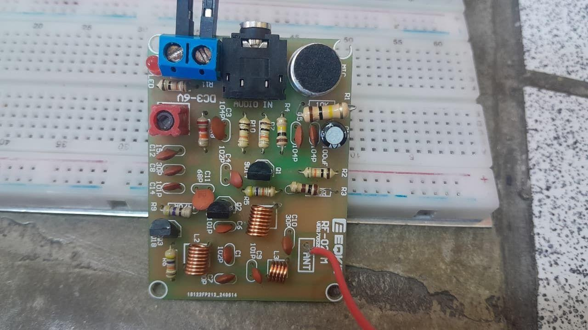
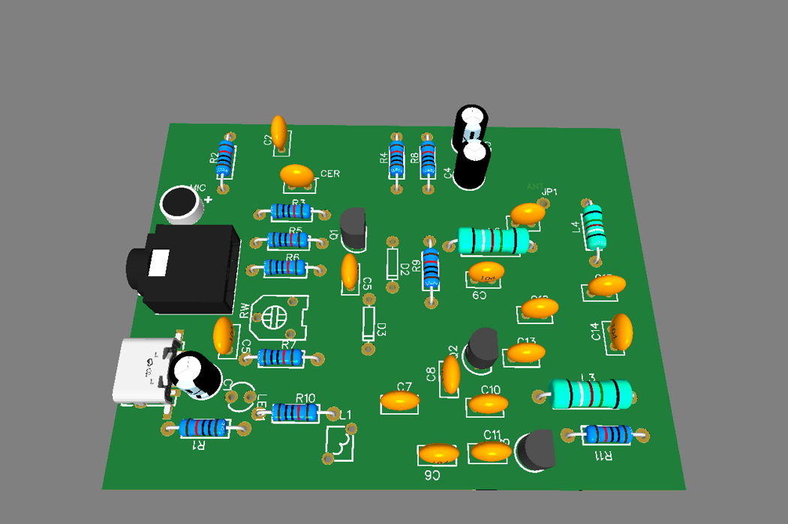
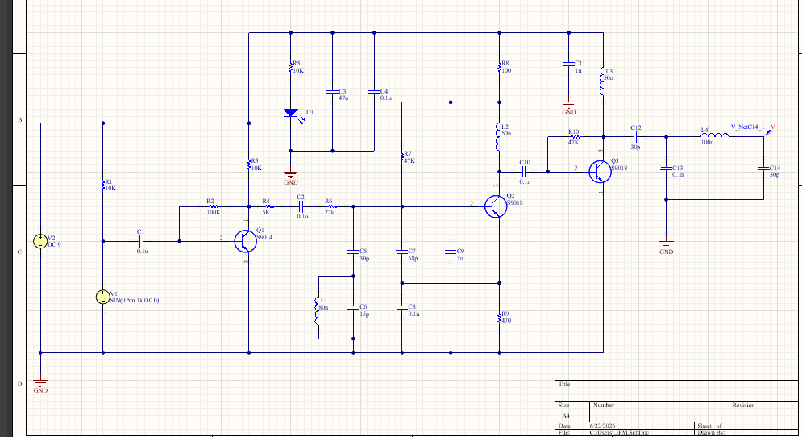
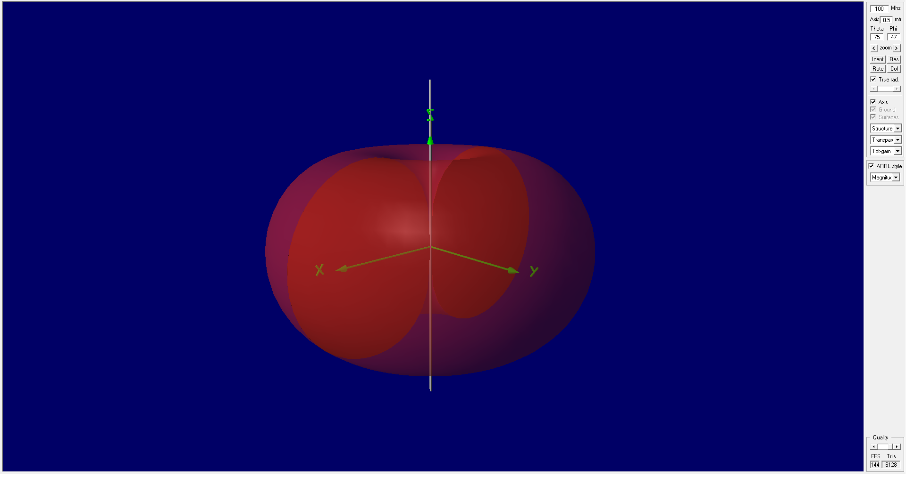
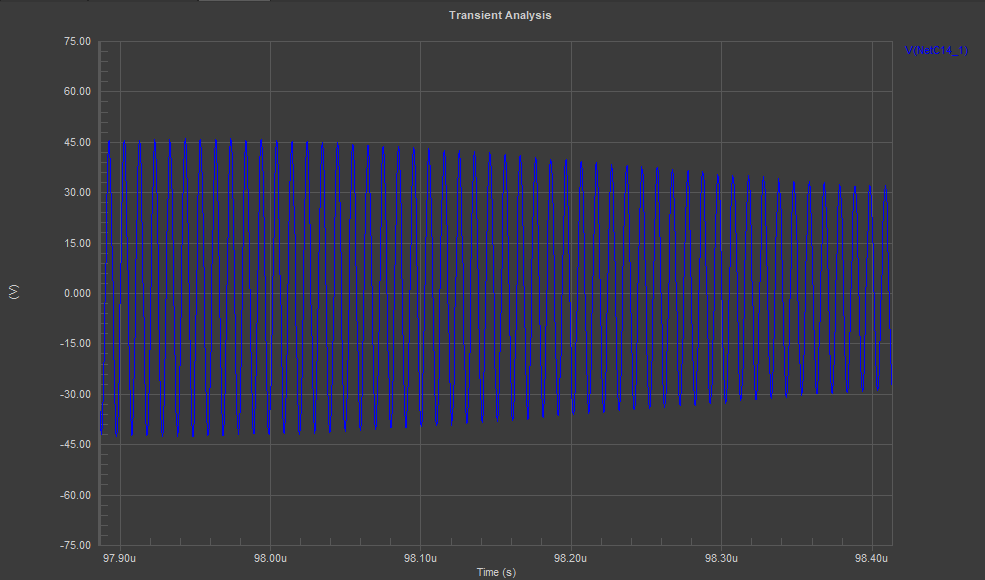

# Low-Power FM Broadcast Transmitter (88–108 MHz)

Low-power analog FM transmitter for the commercial VHF band (88–108 MHz). This project integrates analog RF stages, Altium Designer SPICE simulations, 4NEC2 antenna modeling, and an EasyEDA PCB implementation.

## Demonstration / Project Gallery

| 1. Physical Prototype (Assembled PCB) | 2. EasyEDA PCB 3D Design |
| :---: | :---: |
|  |  |

| 3. RF Circuit Schematic | 4. 4NEC2 Antenna Radiation Pattern | 5. SPICE Transient Simulation |
| :---: | :---: | :---: |
|  |  |  |

## Project Overview

This system was designed, simulated, and physically implemented to transmit audio over the commercial FM broadcast band. It is built with discrete analog components, operating from a 5 V power supply (Arduino Nano) and utilizing high-frequency bipolar junction transistors (BJTs).

## System Architecture

`mermaid
graph TD
    A[Audio Input] --> B[S9014 Common-Emitter Preamplifier]
    B --> C[S9018 Colpitts Oscillator / FM Modulator]
    C --> D[S9018 Class-C RF Amplifier]
    D --> E[Pi LC Output Network]
    E --> F[Antenna]

    classDef stage fill:#f9f,stroke:#333,stroke-width:2px;
    class A,B,C,D,E,F stage;

    subgraph Altium_SPICE [Altium Designer: SPICE Simulation]
        B
        C
        D
        E
    end

    subgraph EasyEDA_PCB [EasyEDA: PCB Design]
        B
        C
        D
        E
    end

    subgraph NEC_Antenna [4NEC2: Antenna Modeling]
        F
    end
`

## RF Signal Chain

### 1. Audio Preamplifier
- **Topology:** Common-Emitter
- **Active Component:** S9014 (NPN BJT)
- **Performance:** Provides a theoretical voltage gain ($) of approximately 49.3 dB at the 9 V design operating point.

### 2. Colpitts Oscillator & FM Modulator
- **Topology:** Colpitts LC Oscillator
- **Active Component:** S9018 (NPN RF BJT)
- **Modulation:** Direct reactive FM modulation via base-emitter junction capacitance variation.
- **Performance:** Theoretical frequency of 84.116 MHz (CALCULATED), tuned physically to 94.6 MHz (OBSERVED) in the prototype. Theoretical FM sensitivity ($) calculated as ~66.08 kHz/V.

### 3. Class-C RF Amplifier
- **Topology:** Common-Emitter with inductive collector load (Class-C)
- **Active Component:** S9018 (NPN RF BJT)
- **Function:** Class-C RF amplification stage intended to improve isolation from load variations.

### 4. Pi LC Output Network
- **Topology:** Passive $\\pi$ (Pi) LC bandpass filter
- **Performance:** Designed for a theoretical center frequency ($) of 101.94 MHz and a theoretical bandwidth of 19.89 MHz (CALCULATED), targeting a nominal 50 $\\Omega$ load match.

### 5. Antenna
- **Design:** Modeled as a theoretical half-wave dipole at 100 MHz in 4NEC2 (SIMULATED).
- **Physical Test:** Field range tests utilized a monopole antenna (OBSERVED).

## Theoretical vs Simulated vs Experimental Results

| Parameter | Value | Evidence Type | Source |
|-----------|-------|---------------|--------|
| Operating target band | 88–108 MHz | DESIGN SPECIFICATION | Project Requirements |
| Theoretical oscillator frequency | 84.116 MHz | CALCULATED | Analytical Model |
| SPICE oscillator frequency | 100 MHz | SIMULATED | Altium SPICE |
| Physical prototype frequency | 94.6 MHz | OBSERVED | Commercial FM receiver |
| Audio voltage gain ($) | 49.3 dB | CALCULATED at 9 V design point | Analytical Model |
| FM sensitivity ($) | 66.08 kHz/V | CALCULATED | Analytical Model |
| Theoretical RF output power | 74.28 mW | CALCULATED | Analytical Model |
| Friis analysis transmit-power assumption | ~60 mW | ESTIMATED / ASSUMED | Theoretical analysis |
| SPICE RF output power | 6.57 mW | SIMULATED | Altium SPICE |
| Pi network center frequency | 101.94 MHz | CALCULATED | Analytical Model |
| Pi network bandwidth | 19.89 MHz | CALCULATED | Analytical Model |
| 4NEC2 dipole length | 1.425 m | SIMULATION MODEL | 4NEC2 DIPOLE.nec |
| 4NEC2 gain | 2.14 dBi | SIMULATED | 4NEC2 |
| 4NEC2 VSWR | 1.506 | SIMULATED | 4NEC2 |
| 4NEC2 return loss | 13.884 dB | SIMULATED | 4NEC2 |
| Observed reception range | up to approximately 50 m | OBSERVED with commercial FM receiver | Field observation |

## SPICE Simulation
Circuit and SPICE simulations were performed in **Altium Designer**. Mixed-signal simulations including Transient, AC Sweep, and Fourier analyses were used to characterize each stage\'s frequency response, gain, and spectral content.

## Antenna Modeling with 4NEC2
The radiation characteristics of a half-wave dipole were modeled using **4NEC2**. The theoretical simulation model exhibited a total length of 1.425 m, yielding a simulated gain of 2.14 dBi, a VSWR of 1.506, and a return loss of 13.884 dB at 100 MHz in free space. Field tests used a physical monopole antenna.

## PCB Design & Fabrication
The PCB was designed in **EasyEDA**. Manufacturing Gerbers were exported, and the physical board was fabricated using a phenolic copper-clad board and ferric chloride etching. The board was then hand-assembled and soldered. *(Note: The original EasyEDA editable design files are not currently archived in this repository; only the Gerber manufacturing outputs are included.)*

## Physical Prototype
The physical prototype was powered by a 5 V supply from an Arduino Nano.

## Experimental Observations
During physical validation:
- The supply voltage was confirmed at 5 V with a multimeter.
- The transmitter was tuned to approximately 94.6 MHz.
- FM audio reception was observed up to approximately 50 m using a commercial FM receiver.

## Bill of Materials
| Component | Value/Part | Stage |
|-----------|------------|-------|
| Transistor | S9014 | Audio Preamp |
| Transistor | S9018 | Oscillator & RF Amp |
| Inductor | Adjustable Ferrite Core | LC Tank |
| Inductor | Fixed RF Inductors | Buffer & Filter |
| Capacitors | Ceramic (various) | Signal Coupling, Tank, Filter |
| Resistors | Carbon Film (various) | Biasing |
| PCB | Phenolic copper-clad | Base |

## Repository Structure
`	ext
Transmisor-FM/
├── docs/                      # Technical reports and documentation
│   ├── Informe_Tecnico_Transmisor_FM_PUBLIC.pdf # Public technical report
│   └── images/                # Curated portfolio images
├── hardware/
│   ├── altium/                # Altium Designer SPICE simulation files
│   └── fabrication/gerber/    # Exported EasyEDA Gerber/Drill files
├── simulation/
│   ├── antenna_4nec2/         # DIPOLE.nec 4NEC2 model
│   ├── captures/              # SPICE & 4NEC2 result screenshots
│   └── spice/                 # Netlist and waveform data
└── README.md
`

## Engineering Limitations
- **Frequency Pulling:** While the Class-C buffer was intended to isolate the oscillator, frequency pulling was still observed in the physical prototype, indicating that isolation was incomplete.
- **Power Supply Mismatch:** Design calculations assumed a 9 V supply, whereas the physical prototype operated at 5 V, leading to differences between theoretical operating points and physical behavior.
- **Antenna Divergence:** While a half-wave dipole was simulated in 4NEC2, a telescopic monopole was utilized for physical range tests.
- **Instrument Limitations:** Direct RF output power, spectral purity, and antenna impedance/VSWR were not characterized with an RF power meter, oscilloscope, or spectrum analyzer.

## Academic Context & Authors
This project was developed as a seven-member university group project for the Analog Communications course in Electronic Engineering at Universidad Nacional Mayor de San Marcos (UNMSM).

**Authors:**
- Purihuamán Rivera, Juan Matías
- Saenz Burga, Alexander Ricardo
- Yactayo Tolentino, Leonardo Sait
- Mestanza Salazar, Elias Fernando
- Huaraca Pariona, Jose Miguel
- Gamarra Galarza, Nayely Dayana
- Condori Ancco, Marco Antonio

*(Individual contribution breakdown is not established by the repository history.)*

## License

Licensing terms have not yet been specified.
